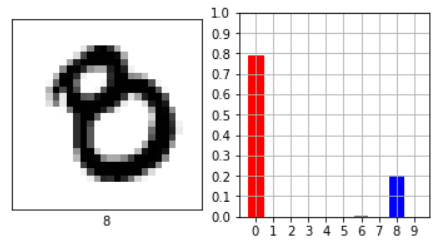

# 🌆 Verslag Computer Vision - Mart Veldkamp 👀

In dit verslag ga ik proberen zo goed mogelijk uit te leggen hoe Computer Vision in elkaar zit en daarnaast paar uitgewerkte voorbeelden uitleggen. Aangezien we voor Deep learning minder zelf moeten coderen en meer moeten begrijpen heb ik ervoor gekozen om dit te doen in een "verslag" vorm. Hiermee zal ik proberen aan te geven wat ik bij elke opgave heb geleerd en daarbij uitleggen hoe het werkt. Ik zal over de volgende aspecten van Computer Vision wat behandelen:

- [Wat is Computer Vision](#1)
- [Olifanten herkenning](#2)
- [Cijfer herkenning](#3)

# Wat is computer Vision 
Computer Vision is erg breed, van image recognition tot object detection. Maar de belangrijkste definitie van ik kan meegeven wat Computer Vision is, is: Het herkennen van een afbeelding-object door een computer. Hoe dit gedaan wordt kan op verschillende manieren, ik zal hier 2 redelijk gebruikte modellen uitleggen, om te beginnen met **cnn**:

Een CNN (Convolutional neural networks), wat een CNN eigenlijk doet is erg simpel, het pakt een afbeelding. In het val hierboven een afbeelding van 28x28. En verkleint de hele tijd een deel daarvan. Dit doet het een paar keer zodat de afbeelding op een gegeven moment wordt de afbeelding zo klein dat hij redelijk makkelijk af te lezen is voor een neuraal netwerk. Dus het is eigenlijk een neuraal netwerk met als input: een compressie (Convolution).

Als 2e gaan we praten over YOLO, YOLO staat voor You Only Look Once. En is bedacht om snel objecten te vinden. Door middel van een afbeelding op te delen in rasters, het zoeken makkelijker te maken. Daarna trekt het om alles wat gezien wordt als een object een bounding box, en met afwegingen van zijn confidence trekt hij uiteindelijke conclusies.

# Olifanten herkenning 
Bij de Olifanten herkenning opgave wouden we kunnen bepalen wanneer een CNN nou weet wanneer een olifant een olifant is. En conlcusies kunnen trekken waarom hij sommigen afbeelding wel classificeert als olifant maar andere niet.

Een voorbeeld van een foute voorspelling van de linker afbeelding hierboven, deze olifant is door het model herkent (met een accuracy met 68.42%) als scuba duiker. Mijn hypothese is dat het CNN-model ook kijkt naar de achtergrond in plaats van het object. Dus in dit geval wordt een donker object in het water (blauw achtergrond) gezien als een duiker.

Daarnaast hebben we een tekening van een olifant, ook verkeerd herkend, maar denkt het model maar met 33% zekerheid dat het een gesp is. De conclusie dat we hier uit kunnen trekken is dat net zoals de scuba duiker, er gekeken wordt naar kleur. Een hele witte achtergrond komt niet vaak voor bij olifanten. Maar omdat het een tekening is, is dat wel mogelijk. Mijn conclusie is daarom ook dat een CNN-model niet echt geschikt is voor het classificeren van afbeeldingen.

# Cijfer herkenning 

We moesten ook voor Computer Vision een neuraal netwerk trainen die cijfers kan herkennen, en eventueel kijken wat er fout kan gaan. Daar heb ik 2 voorbeelden van:

Wat ik met de foto hierboven wou laten zien is dat het model (met een hoge score) ziet dat het twee is, maar we als mens daar zelf misschien anders over denken. In dit geval was het ook een 2, alleen toen ik het mijn beide ouders vroeg. Wisten ze niet met zekerheid te vertellen wat het was. Dus blijkbaar kijkt in sommigen aspecten een CNN netwerk anders naar afbeeldingen dan we. Terwijl we als mens misschien nooit een lus in een 2 verwachten.

Daarnaast heb je deze foto, we als mens zien hier duidelijk een acht in, waarom? Omdat het heel beknopt gezegd: 2 rondjes heeft waarvan 1 kleiner dan de anders en de kleinste zit aan de bovenzijde. We kunnen in ieder geval concluderen dat dit een acht is, terwijl het neuraal netwerk dit met 79% zekerheid een 0 geeft. Waarom is dit zo? Is dit omdat hij gedraaid staat? Misschien, jammer genoeg kun je nooit met zekerheid vertellen waarom een Neuraal netwerk gedraagt zoals het doet.