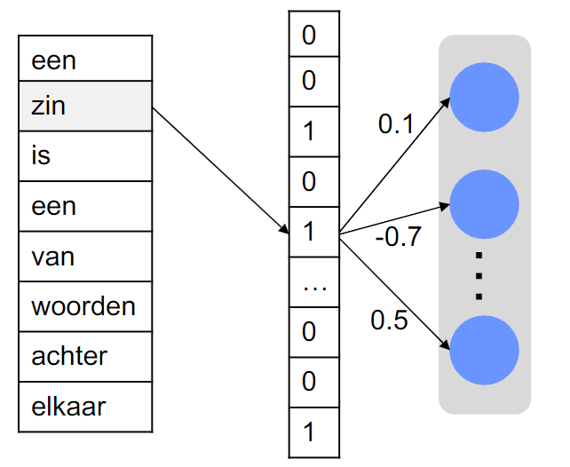

# 📜 Verslag Taalverwerking - Mart Veldkamp 🈵

In dit verslag ga ik proberen zo goed mogelijk uit te leggen hoe Taalverwerking in elkaar zit en daarnaast paar uitgewerkte voorbeelden uitleggen. Aangezien we voor Deep learning minder zelf moeten coderen en meer moeten begrijpen heb ik ervoor gekozen om dit te doen in een "verslag" vorm. Hiermee zal ik proberen aan te geven wat ik bij elke opgave heb geleerd en daarbij uitleggen hoe het werkt. Ik zal over de volgende aspecten van Taalverwerking wat behandelen:

- [Wat is Taalverwerking](#1)
- [imbd](#2)
- [spam filter](#3)

# Wat is Taalverwerking 

Taalverwerking, ook wel **Natural Language Prepocessing** genoemd. Is het processen / begrijpen van taal door een computer / machine. Dit kan helpen bij veel verschillende applicaties van spam filter tot aan Google assistent/Siri. Nu blijkt het vanaf fundament begrijpen van talen door machines een erg moeilijke taak. Maar wat zijn nou de stappen die een machine moet zetten om van tekst iets te maken wat een neuraal netwerk begrijpt?

Als eerst split je je data op, je kijkt wat relevante informatie is. Net zoals de foto hierboven! Bijvoorbeeld: *Het is morgen mooi weer en ik doe een korte broek aan.* Je zou de hele zin mee kunnen geven als bag aan een neuraal netwerk. Maar dat kost erg veel tijd, ook met meer data. Dus probeer je irrelevante informatie eruit te halen, dan krijg je misschien: *morgen mooi weer ik korte broek.* Het klinkt een stuk minder mooi, maar je begrijpt de rooie draad nog wel! Dit noemen we een stop list. Waar woorden die niet relevant zijn voor de inhoud van een zin, eruit worden gehaald.

Daarna kunnen we kijken naar hoe vaak elk woord in een zin, voorkomt. Om zo te bepalen wat het belangrijkste (inhoudelijk) is aan te zin. Dit wordt **Bag-of-words** genoemd. Het nadeel van deze techniek is dat het neuraal netwerk de volgorde van de woorden verliest. Wat soms best belangrijk kan zijn.

Een andere manier om dit op te lossen is door iets genaamd **NGRAMS**. Deze techniek groepeert woorden in een zin per **N** en behoudt zo de structuur van de zin. In ons geval ziet het er ongeveer zo uit:

- Zin: *morgen mooi weer ik korte broek.*
- 1-GRAMS: *morgen, mooi, weer, ik, korte, broek*
- 2-GRAMS: *morgen mooi, mooi weer, weer ik, ik korte, korte broek*
- 3-GRAMS: *morgen mooi weer, mooi weer ik, weer ik korte, etc.*

Wat je ziet, is naarmate hij meer woorden aan elkaar linkt, er meer van de zin begrepen wordt (morgen mooi weer > morgen). Wat je ook kan zien is naarmate je de NGRAM verhoogt, je steeds meer woorden aan elkaar krijgt gelinked, dus het gaat steeds meer tijd kosten.

# imbd 
Dus wat zijn nou de stappen om context uit een stuk tekst te halen? We gaan het proberen te testen door middel van de imbd dataset. In deze dataset staan heel veel reviews met daarbij of de review positief of negatief is. En we willen door middel van verschillende methodes kijken welk model het beste kan bepalen of een reviews positief of negatief is.

Om hier een conclusie aan te geven wil ik eerst wat vertellen over **Word2Vec**:

Word2Vec doet wat het zegt, en zet woorden om in vectoren. Dit is erg handig voor het begin, om woorden om te zetten in iets wat de machine kan lezen / begrijpen.

Door middel van deze Word2Vec kun je de text gebruiken om een model zoals LSTM, RNN of 1D convolutie netwerk te trainen. Wat natuurlijk je uiteindelijk doel is.

# spam filter 

Bij de spam filter proberen we spam te detecteren door middel van een Neuraal Netwerk data te geven wat gezien wordt als spam, dan het te trainen op die data. Ten slot te bekijken hoe goed onze filter werkt.

Wat je kan zien, als je trainings- data opent, is een e-mail zoals een e-mailprogramma dit ontvangt. Een e-mail bestaat uit een header, waar aan we o.a. kunnen zien wie de afzender en ontvanger zijn en langs welke tussenstations de mail verstuurd is. Na de header volgt een lege regel en dan de inhoud van de e-mail.

We kunnen de e-mails inlezen als tekstbestanden zoals we zojuist hebben gedaan, maar dan zal blijken dat sommig e-mails ander gecodeerd zijn en we niet alle bestanden kunnen openen. In plaats daarvan laten we Python het werk voor ons opknappen door de 'email' library te gebruiken.

Deze data is nog steeds niet geschikt voor Machine Learning, aangezien er erg veel html in staat, waar het model wat mee moet. Om dit te verwijderen maken we gebruik van een library genaamd *Bueatiful soup*. En ten slot kunnen we trainen.