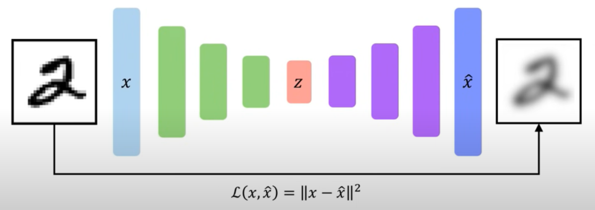

# 🧠 Verslag Generative Deep Learning - Mart Veldkamp 📚

In dit verslag ga ik proberen zo goed mogelijk uit te leggen hoe Generative Deep Learning in elkaar zit en daarnaast paar uitgewerkte voorbeelden uitleggen. Aangezien we voor Deep learning minder zelf moeten coderen en meer moeten begrijpen heb ik ervoor gekozen om dit te doen in een "verslag" vorm. Hiermee zal ik proberen aan te geven wat ik bij elke opgave heb geleerd en daarbij uitleggen hoe het werkt. Ik zal over de volgende aspecten van Generative Deep Learning wat behandelen:

- [Wat is Generative Deep Learning](#1)
- [autoencoder](#2)
- [simple gan](#3)

# Wat is Generative Deep Learning 
Dus wat doen Deep Generative Modellen nou anders dan andere modellen? Laten we beginnen met een voorbeeld, wat is nou *Generative*. Eigenlijk heel simpel: Een Generative Deep Learning model genereert iets. Maar dan op grotere schaal, de meest gebruikte voorbeelden zijn deep fakes. Foto's van mensen die eigenlijk helemaal niet bestaan, audio van mensen die nooit iets hebben ingesproken, etc. Maar hoe kan een Generative Deep Learning model nou zo goed foto's genereren of mensen na doen? Zoals de meest (leuke) deep learning modellen zijn Generative Deep Learning modellen *Unsupervized*, dit betekend dat we wel data hebben. Maar niet gelabeld. Het doel hiervan is het model laten zoeken naar de underliggende relatie in data die we als mens soms zelf niet eens zien.

 
Je hebt 2 soorten Generative modellen, **1. Density Estimation:** Waar we een paar samples zien, en we een relatie willen vinden tussen de punten. & **2. Sample generation:** Waar we een model data geven en we van het model vragen hele nieuwe data te genereren.

# Autoencoder 
Een voorbeeld van een erg simpele Generative Deep Learning model is een Autoencoder. Een Autoencoder probeert data de genereren door middel van de input te *encoden*. Autoencoders worden vooral gebruikt om lager dimensionale feature representaties te leren van niet gelabelde data.

Een autoencoder lijkt best op een Neuraal netwerk, omdat het dezelfde features heeft: een Input, een stuk hidden layers, en een Output. Maar wat hierbij hoort, is het stukje "Code" wat je in het midden ziet. Dit is er omdat we (meestal een vector) zo compact mogelijk willen maken, dit komt omdat met foto's meestal zien dat je erg veel dimensies hebben, en dit is niet altijd goed voor een neuraal netwerk. Het nadeel is dat de output eigenlijk altijd (ook in ons geval) er onder lijdt.

# Simple GAN 
Bij het maken van een simpele GAN (Generative Adversarial Network). Het idee van een GAN is dat we niet zo zeer de data density zo compact mogelijk willen maken. Maar daarentegen voorbeelden pakken om zo gelijk nieuwe data te genereren. Het voordeel wat dit heeft is dat je nu data kan genereren uit complexere data. Hoe ze dit aanpakken is redelijk simpel:

Ze hebben een "Generator" netwerk die random noise veroorzaakt. En dit netwerk is getraind om een transformatie te leren om van die "noisy" data naar training data te gaan. En het doel hiervan is dat we onze fake noise data zo dicht mogelijk willen lijken op de echte data, maar toch niet hetzelfde.

Wat we hier eigenlijk mee bedoelen is dat we 2 neuraal netwerken hebben: de Generator en de Discriminator. Deze 2 netwerken concurreren de hele tijd met elkaar. De generator maakt vanuit noise een imitatie van de echte data om zo de discrimator te foppen. Zodat het niet de *fake* data kan onderscheiden met de echte. En de Discrimator probeert fake data te onderscheiden van echte data. Door deze constante heen en weer gaan van een foto genereert een GAN en erg accurate en bijna echte afbeelding van bijvoorbeeld een persoon.

# Bronnen
- [MIT 6.S191 (2020): Deep Generative Modeling](https://www.youtube.com/watch?v=rZufA635dq4)
- [Towards data science](https://towardsdatascience.com/applied-deep-learning-part-3-autoencoders-1c083af4d798)
- [Simpelle GAN](https://wiki.pathmind.com/generative-adversarial-network-gan)