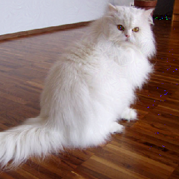

# 🧠 Verslag Reinforcement Learning - Mart Veldkamp 📚

In dit verslag ga ik proberen zo goed mogelijk uit te leggen hoe Reinforcement Learning in elkaar zit en daarnaast paar uitgewerkte voorbeelden uitleggen. Aangezien we voor Deep learning minder zelf moeten coderen en meer moeten begrijpen heb ik ervoor gekozen om dit te doen in een "verslag" vorm. Hiermee zal ik proberen aan te geven wat ik bij elke opgave heb geleerd en daarbij uitleggen hoe het werkt. Ik zal over de volgende aspecten van deep learning wat behandelen:

- [Wat is Reinforcement Learning](#1)
- [Hacking](#2)
- [Rubiks Cube](#3)

# Wat is Reinforcement Learning 
Zo wat is het verschil tussen normale Deep learning methodes en Reinforment Learning? Voor mij het grote verschil zit hem in de scope van het leren. De meest gebruikelijke manier om een neuraal netwerk te trainen is door middel van een dataset. Als we bijvoorbeeld een machine Tetris willen laten spelen. Zou dat betekenen dat we data nodig hebben van iemand die Tetris (het liefst goed) speelt. En daarop het netwerk trainen, helaas wordt ons model- of agent nooit beter dan de speler. Aangezien we de data van die speler gebruiken. Dit proces noemen we supervized learning.

Maar is er een manier voor een agent om een game "zelf" te spelen en daarvan te leren? Gelukkig wel: en dit noemen we Reinforcement learning, de framework voor Reinforcement Learning is grappig genoeg bijna hetzelfde als bij je standaard supervized learning. We hebben nog steeds een input, hidden layers en output (in het geval van Tetris is de output: blok naar rechts, links of draaien). Het enige verschil zit hem in het feit dat we niet de target label weten, wat dit betekend is dat we eigenlijk helemaal niet weten wat we moeten doen. Maar hoe kunnen we een machine dan alsnog leren wat een goeie actie is... Het makkelijkste manier om dit de doen is door middel van iets genaamd Policy Gradient.

Maar je kunt natuurlijk ook een convolutionele oplossing gebruiken...

Realistisch gezien bestaat je output uit heel veel % kansen die het model denkt dat het slimst is om te doen op een gegeven moment. Maar wat zo handig is, is dat je door middel van "random" samples je agent kan laten kijken naar betere acties (hier vind het leren plaats). Met als hoop dat hij betere uitkomsten krijgt, wat leidt tot een beter model. Maar waar kijken we nu naar in het geval van Tetris, bij een beter beloning? Dat licht aan wat je wilt? Wil je de hoogste score? Geef het netwerk dan een beloning voor in één keer een hoge score krijgen. Wil je zo lang mogelijk spelen? Geef dan je netwerk een beloning voor zo lang mogelijk laag blijven. Dit verschilt natuurlijk per probleem, en is zeer belangrijk bij het maken van een Reinforcement Learning netwerk. Dus in het kort wat we elke keer proberen te bereiken is:

En natuurlijk zul je, je agent aan het begin heel vaak fouten maken, en game over gaan. Maar het leuke is dat soms, door middel van random inputs. Hij een beslissing maakt wat hem helpt, en daarop verder traint. En zo doordat hij uiteindelijk beter is dan de beste mens. Hetzelfde geld voor negatieve beloning, als je Tetris model 10 blokjes op elkaar stapelt. Geef je het een negatieve beloning (beloning) mee. Om zo te voorkomen dat hij dit nog een keer doet in de toekomst.

## GAN 
Als je een Image Recognition model een afbeelding van een kat geeft. Zal deze met bijna 100% zekerheid vertellen dat dit een kat is. Wat als ik je zou vertellen dat je een Image Recognition model zo kan trainen dat hij een afbeelding van de kat zo manipuleert dat dit ook (bijvoorbeeld) een broodrooster kan zijn? Dat is wat we precies hier doen!

Deze foto hierboven gaan we proberen door middel van een Reinforcement model om te zetten zodat het Image Recognition model van 80% zekerheid weet dat het een brood rooster is. Dit doen we door middel van een output ontvangen, met in dit geval een % waarde, hoe zeker het weet dat het een broodrooster is. Dit zal ergens in de 0.01% zijn. Maar door middel van onze afbeelding aan te passen, en dat kan van tussen waziger maken tot een paar pixels veranderen. Daarna kijken we of de afbeelding niet teveel is veranderd. Zodat jij en ik nog wel weten dat het een kat is, maar het model niet meer. En dit doen we eigenlijk in een loop, we veranderen dus de hele tijd waarde in de afbeelding zodat het model denkt dat het lijkt een broodrooster, maar voor ons nog steeds lijkt op een kat. De foto hierboven is het eindresultaat, ik wilde natuurlijk makkelijk kunnen zeggen dat het een kat is. Maar grappig genoeg het model niet meer.

## Rubiks cube 
We gaan door middel van een Reinforcement Learning model proberen een Rubiks Cube op te lossen. Dit gaan door middel van een krachtige Reinforcement Learning techniek, genaamd: **feature-based Q-Learning**. Met daarnaast **the utilization of a pattern database**. Om zo de kwaliteit van een bijna afgemaakte Rubiks Cube te kunnen meten.

Als ik de README mag quoten:

*this project assumes that a Rubik's cube can only execute 180 degree side turns, which greatly reduces the branching factor of the cube's state space tree*

Daarnaast gaan we ook proberen de Rubiks Cube op te lossen voor een aantal moves (*n*). Maar eerst, wat is Q-Learning?

 

Wat beknopt: Q-learning is een manier-algoritme waardoor we nieuwe waardes kunnen bepalen, wat "betere" waardes zijn, voor het model. Het lijkt best erg op Backpropogation, alleen zit er nu nog iets extra's bij genaamd "Temporal difference". Wat dit is, is eigenlijk alles wat je nodig hebt voor het gebruiken van Reinforcement Learning. Het neemt naast je oude waardes en de learning rate; de beloning, discount factor en "estimate of optimal future value" mee.

En als we dit loslaten op ons probleem, met wat code. Krijgen we een erg mooi resultaat. Met een computer wat sneller een Rubiks Cube kan oplossen dan elk mens op de aarde.

(ik kon de file niet normaal uploaden, dus heb ik hem gezipt.)